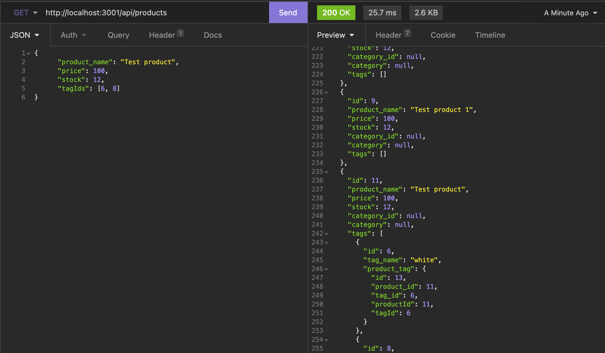

# E-commerce_back-end

## Bootcamp homework

A manager for an internet retail company requires an updated e-commerce website back end in order to compete effectively in the market. The following "Acceptance Criteria" for this feature were requested and have now been implemented:

- Examples

Additionally, a video walk-through highlighting the program's functionality has been created and linked (below), and the Javascript includes comments.

## UPDATE -- E-commerce -- File screenshot

The following is a screenshot of the Insomnia interface, highlighting the back-end program's appearance and functionality:

## Link to video walk-through:

As the e-commerce back-end application cannot be deployed at a live URL, a video highlighting a walk-through of using this application is included here: [LINK]
